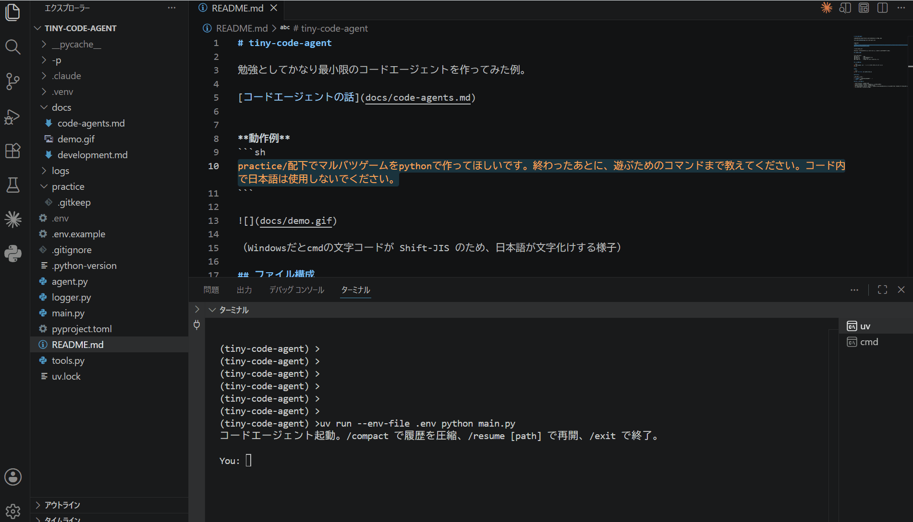

# tiny-code-agent

勉強としてかなり最小限のコードエージェントを作ってみた例。

[コードエージェントの話](docs/code-agents.md)


**動作例**
```sh
practice/配下でマルバツゲームをpythonで作ってほしいです。終わったあとに、遊ぶためのコマンドまで教えてください。コード内で日本語は使用しないでください。
```



（Windowsだとcmdの文字コードが Shift-JIS のため、日本語が文字化けする様子）

## ファイル構成

```
tiny-code-agent/
├── main.py        # 実行
├── agent.py       # エージェントループ
├── tools.py       # ツール定義
└── logger.py      # 会話ログ出力（`/resume`に使用）
```

## セットアップ

```bash
cp .env.example .env   # .env を作成し GEMINI_API_KEY を記入
uv sync
```

## 実行

```bash
uv run --env-file .env python main.py
```

## コマンド

| コマンド | 説明 |
|---------|------|
| `/compact` | 会話履歴を要約して圧縮 |
| `/exit` | 終了 |

## AIが使用するツール

- read_file(path): ファイルを読む
- write_file(path, content): ファイルを一括作成（上書き）
- append_file(path, content): ファイルに追記
- str_replace(path, old_str, new_str): ファイル内の文字列を置換（old_strはファイル内に一意に存在する必要がある）
- run_code(code): Pythonコードを実行
